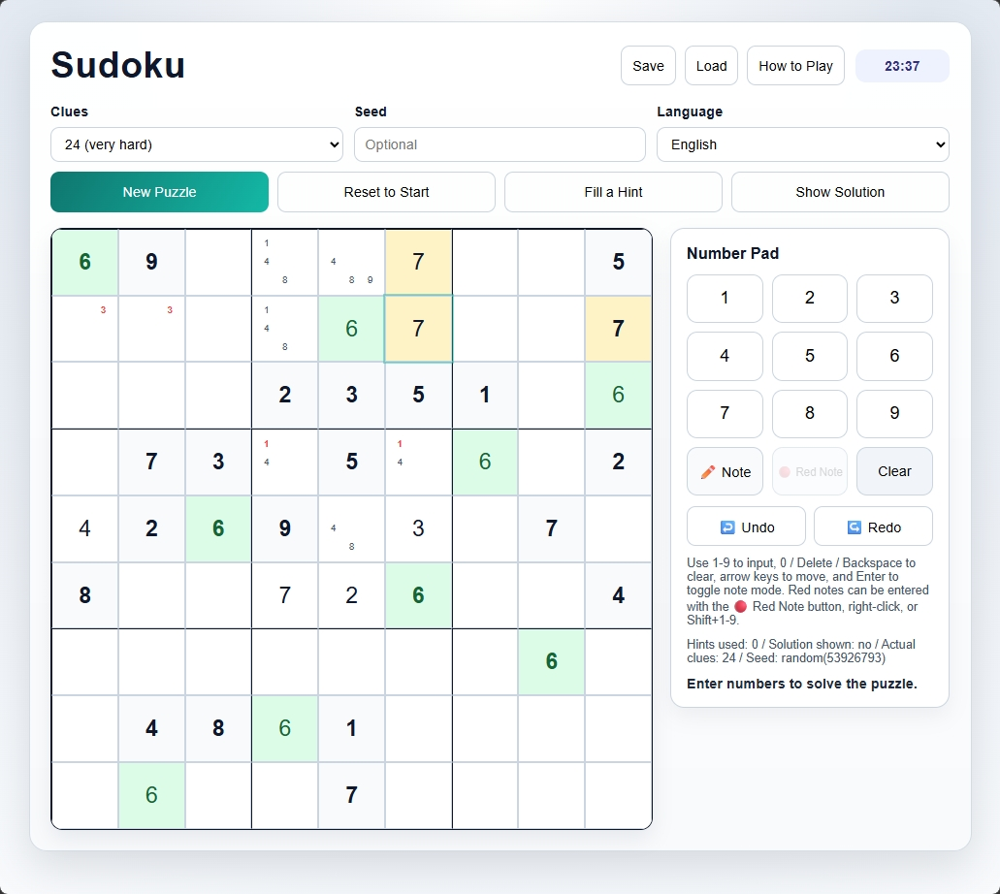
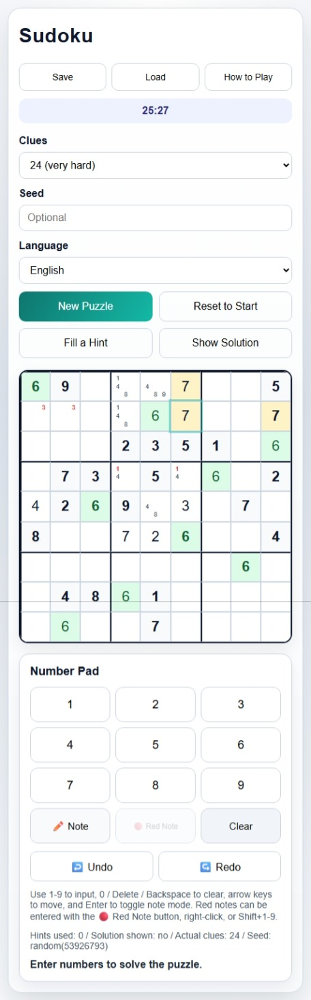

# Sudoku HTML

Sudoku HTML is a browser-based Sudoku game that you can play using a single `Sudoku.html` file. This repository contains the split source code, tests, build script, documentation, and GitHub Actions workflows used for online publishing and release distribution.

| Desktop view | Mobile view |
| --- | --- |
|  |  |

## Play the Game

**Download the HTML file**: [Sudoku.html](https://github.com/piccoripico/sudoku-html/releases/latest/download/Sudoku.html)

- Open the downloaded `Sudoku.html` directly in your browser to play offline.

**Play online**: <https://piccoripico.github.io/sudoku-html/>

- You can also open the same program online.
- After the page has loaded, you can continue playing without an internet connection during that session.

## Highlights

- **Portable**: The entire app is packaged into a single `Sudoku.html` file, so you can keep it on your computer or phone and take it anywhere.
- **Offline**: The app runs offline, so you can play without an internet connection.
- **Desktop / mobile UI**: The layout is designed to work comfortably on both wide desktop screens and tall mobile screens.
- **Number of completed boards**: A single template family alone can generate more than about 609.5 billion transformed completed boards. The app uses multiple template families, so the overall variety is even larger.
- **Board reproducibility**: Enter the same seed value with the same clue count to recreate the same puzzle, including the clue layout.
- **Save and resume later**: You can save your current board, notes, timer, and Undo/Redo history. Loading the saved file lets you resume from the same state.

## Documents

- [Repository Guide (Japanese)](./README.ja.md)
- [Game Guide (English)](./docs/GAME_GUIDE.md)
- [Game Guide (Japanese)](./docs/GAME_GUIDE.ja.md)

## Repository Structure

- [`src/`](./src): HTML, CSS, and JavaScript source files
- [`tests/`](./tests): Automated tests for puzzle generation and state handling
- [`scripts/build.mjs`](./scripts/build.mjs): Build script that converts the split source files into a single `dist/Sudoku.html`
- [`docs/`](./docs): Screenshots and end-user documentation
- [`.github/workflows/`](./.github/workflows): Automation for CI, Pages, and releases

## Development

1. Run `npm ci`.
2. Run `npm test`.
3. Run `npm run build`.
4. The first time you use browser tests, run `npm run test:e2e:install`.
5. Run `npm run test:e2e` for browser smoke tests, or `npm run verify` for the full local check.

`dist/` is intentionally excluded from Git. The downloadable `Sudoku.html` file is generated from source by the release workflow.

## Automation

GitHub Actions automates testing, Pages deployment, and release asset generation.

- CI: [`.github/workflows/ci.yml`](./.github/workflows/ci.yml) runs for pull requests targeting `main`, and you can also start it manually from the `Actions` tab.
- Pages: [`.github/workflows/pages.yml`](./.github/workflows/pages.yml) runs on pushes to `main`, builds `dist/Sudoku.html`, and publishes it to GitHub Pages at <https://piccoripico.github.io/sudoku-html/>.
- Release: [`.github/workflows/release.yml`](./.github/workflows/release.yml) runs when you push a version tag such as `v1.2.3` and automatically attaches `Sudoku.html` to the GitHub Release.
