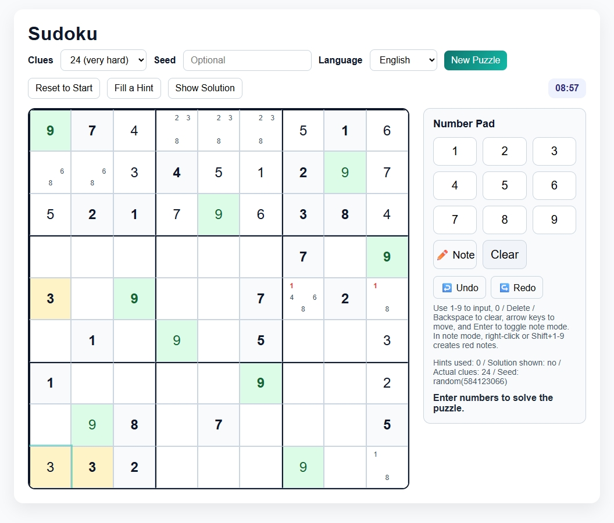
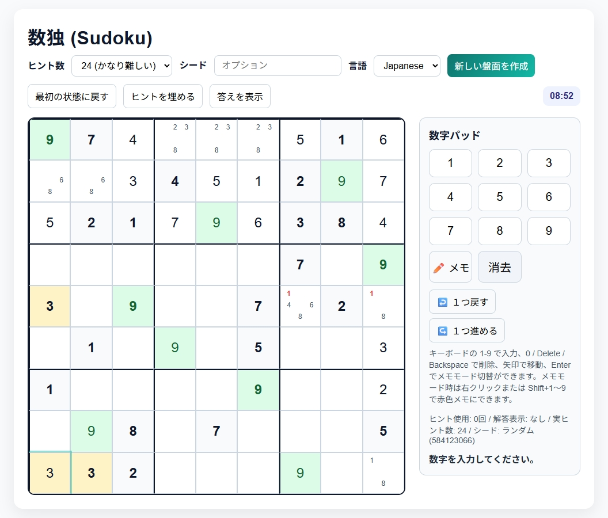

# Sudoku (数独)

### No internet connection or installation required
Just open `Sudoku.html` directly in your browser and start playing right away.
### インターネットもインストールも不要
`Sudoku.html` を直接ブラウザで開けば、そのままプレイできます。

## Screenshot

---

### Overview
This is a browser-based Sudoku game. You can switch between **Japanese / English** using the language selector.

### Getting Started
1. Download [`Sudoku.html`](https://github.com/piccoripico/Sudoku/releases/download/Sudoku/Sudoku.html).
2. Double-click the downloaded `Sudoku.html`.  
   (Or drag and drop it into a browser such as Chrome or Edge.)
3. You can start playing Sudoku immediately.

### Controls (Mouse)
- **Enter a number**: Click `1` to `9` on the number pad
- **Clear**: Click `Clear` on the number pad
- **Move to a cell**: Click the cell on the board where you want to enter a number
- **Toggle note mode**: Click the `✏️Note` button on the number pad
- **Red notes**: While in note mode, **right-click** `1` to `9` on the number pad
- **Undo / Redo**: Click the `↩️Undo` / `↪️Redo` buttons

### Controls (Keyboard)
- **Enter a number**: `1` to `9`
- **Clear**: `0` / `Backspace` / `Delete`
- **Move between cells**: Arrow keys
- **Toggle note mode**: `Enter`
- **Red notes**: `Shift+1` to `9`
- **Undo / Redo**: `Ctrl+Z` / `Ctrl+Y` (`Ctrl+Shift+Z`)

### Main Features
- **Clues**: You can specify how many clues are shown on a new puzzle.
- **Seed**: Entering the same seed value generates the same puzzle.  
  (If no seed is entered, a random puzzle is generated.)
- **Timer**: Measures the time from puzzle generation until completion.
- **Duplicate number warning**: Highlights duplicate numbers.
- **Highlight completed numbers**: Highlights numbers that have been fully completed.
- **Reset to Start**: Resets the puzzle to its original starting state.
- **Fill a Hint**: Adds another hint during play.  
  (Hints are filled in starting from the empty cells at the top left.)
- **Show Solution**: Displays the solution.

---

## 日本語

### 概要
ブラウザ向けの数独ゲームです。言語セレクタで **Japanese / English** を切り替えできます。

### はじめかた
1. [`Sudoku.html`](https://github.com/piccoripico/Sudoku/releases/download/Sudoku/Sudoku.html) をダウンロードします。
2. ダウンロードした `Sudoku.html` をダブルクリックします。 （またはChromeやEdgeなどのブラウザにドラッグ＆ドロップします。）
3. すぐに数独をはじめられます。

### 操作方法（マウス）
- **数字入力**: 数字パッドの `1`～`9` をクリック
- **消去**: 数字パッドの `消去` をクリック
- **セル移動**: 盤面の入力したいマスをクリック
- **メモ切替**: 数字パッドの `✏️メモ` ボタンをクリック
- **赤色メモ**: メモモード時に数字パッドの `1`～`9` を**右クリック**
- **1つ戻る / 1つ進める**: `↩️1つ戻る` / `↪️1つ進める` ボタンをクリック

### 操作方法（キーボード）
- **数字入力**: `1`〜`9`
- **消去**: `0` / `Backspace` / `Delete`
- **セル移動**: 矢印キー
- **メモ切替**: `Enter`
- **赤色メモ**: `Shift+1`〜`9`
- **1つ戻る / 1つ進める**: `Ctrl+Z` / `Ctrl+Y`（`Ctrl+Shift+Z`）

### 主な機能
- **ヒント数**: 新しい盤面に表示されるヒント数を指定できます。
- **シード**: 同じシード値を入力すると、同じ盤面を生成できます。（シード値の入力がなければランダム）
- **タイマー**: 盤面を作成してから解答するまでの時間を計測します。
- **重複数字の警告**: 重複する数字をハイライト表示します。
- **完成数字の強調**: 完成した数字をハイライト表示します。
- **最初の状態に戻す**: 盤面を最初の状態にリセットします。
- **ヒントを埋める**: プレイ中にヒントを増やせます。（左上の空欄から埋めていきます。）
- **答えを表示**: 解答を表示します。
